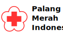

  

<h1 align="center">
  PMI's default starter
</h1>

Kick off your project with this default boilerplate. This starter ships with the main PMI configuration files you might need to get up and running blazing fast with the blazing fast app generator for React.

_Have another more specific idea? You may want to check out our vibrant collection of [official and community-created starters](https://go.ifrc.org/)._
